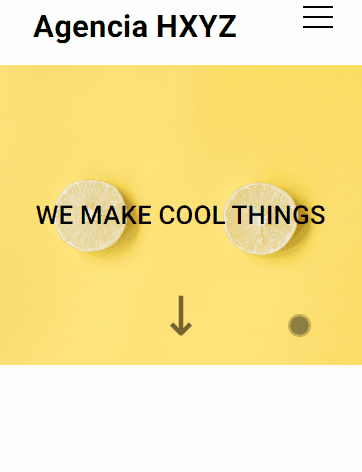

# LANDING PAGE

Esse projeto foi criado durante meu processo de estudo front-end. A pagina é responsiva, onde o modelo mobile tem algumas alterações. 

## Visão Geral

### Visão geral desktop

  
### Visão geral mobile
 

## Processo

### Linguaguens Utilizadas

- HTML
- CSS
    - Grid
    - Flex
    - Pseudo-Elementos, Pseudo-classes
    - Animation 

### O que aprendi

A construção do menu mobile foi um dos meus maiores desafios, mas por pequenos detalhes. Durante toda a construção dele quis entender cada detalhe, como os pseudo-elementos after e before que são extremamente uteis. 
Ao fim, o resultado foi gratificante.

## Autores

- [DevQuest](https://www.linkedin.com/company/dev-em-dobro/)
- [Maria Eduarda Nascimento](https://www.linkedin.com/in/mariaeduarda-nascimento/)

